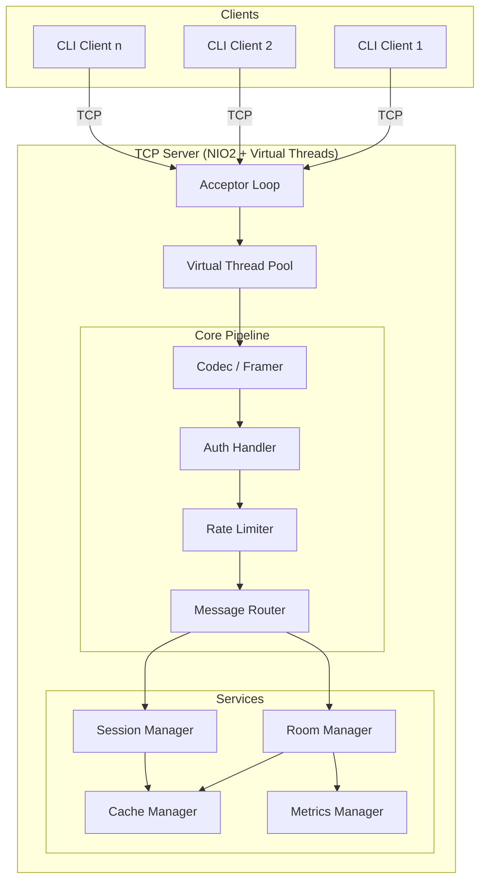

A real-time, multi-room chat system built from raw TCP sockets in Java 21+, using NIO2 channels, virtual threads, and production-hardened infrastructure. Gradle multi-module build.

---

## High-Level Architecture

---

